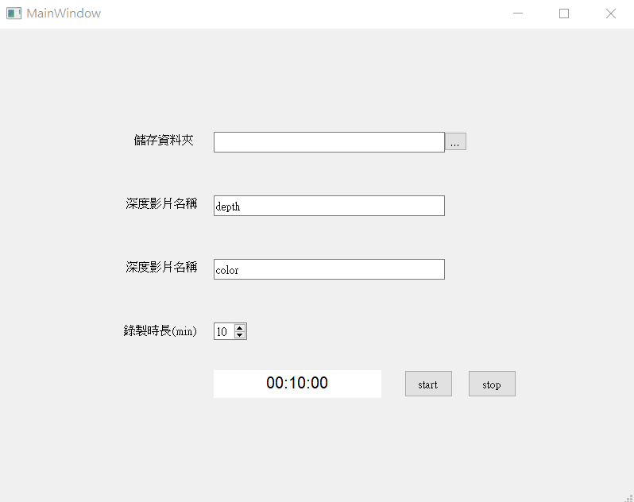

# kinectv2 recording tool

A kinectv2 recording tools with timer made by pyQt5.

## Installation

```Shell
pip install -r requirements.txt
```

pykinect2 :  https://github.com/Kinect/PyKinect2/tree/master/pykinect2

* if error occur : replace .py file in site-package by the file in github

Install [Kinect for Windows SDK v2](http://aka.ms/k4wv2sdk)

## GUI


